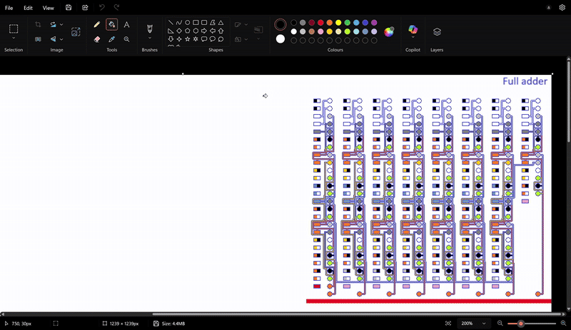
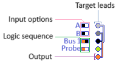
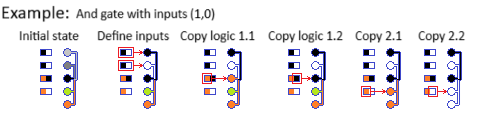

I desigend a full set of logic gates that function natively within MS Paint using only the eye-dropper and the bucket/fill tools. These were combined to make an 8-bit ripple-carry adder as well as an 8-bit adder/subtractor circuit.

Ripple-carry adder 203 + 110 = 313 (in binary: 11001011 + 01101110 = 00111001 + carry 1):

adder/subtractor for 10+3=13 (in binary: 1010 + 11 = 1101):

Adder/subtractor for 8-3 = 5 (in binary: 1000 - 11 = 101):

What started as a joke about the worst way to do statistics, turned into an cognitive itch, and side hobby. 

## Logic Gate Anatomy

## AND gate example

Instructions:
1. Define colors for A and B (white = 0, black  = 1). 
2. Using the colour-picker and bucket/fill tools, cycle through copy/pasting the colours in the "Bus" and "Probe" squares on the left into the leads on the right. When there is more than one colour in the source, cycle through them in order from left to right. 

Tip: press "b" to activate the fill tool, press "i" to activate the colour-picker tool (when you click to select a colour, it will automatically switch back to the fill tool, so you only need to press "b" once at the start)
