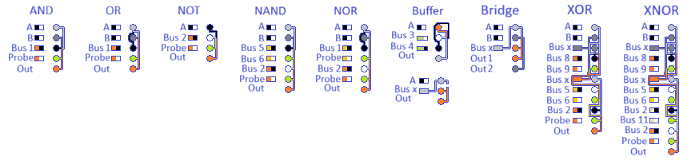
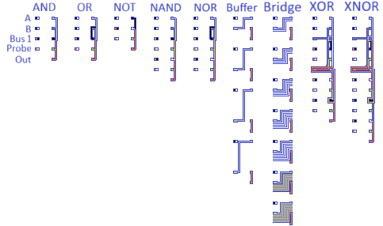

## Background

What started as a joke about the worst way to do statistics, turned into an cognitive itch, and side hobby. 

I designed a full set of logic gates that function natively within MS Paint using only the eye-dropper and the bucket/fill tools. These were combined to make an 8-bit ripple-carry adder as well as an 8-bit adder/subtractor circuit.

## Anatomy of a Logic Gate 

This is an example of the AND logic gate:

The logic gate is executed as follows:
1. Define colors for A and B (white = 0, black  = 1). 
2. Using the colour-picker and bucket/fill tools, cycle through copy/pasting the colours from the logic/instruction sequence boxes on the left to their corresponding leads on the right. When there is more than one colour in the instruction, cycle through them from left to right. 

The following is a step-by-step execution of the above instruction for the AND gate:

## Full set of logic gates

The following is the full set of logic gates as well as bridges and buffers, which are used either to hold values to prevent back-propagation or to cross wires.

More complex circuits may require additional space, therefore, future circuits will use more compact design of logic gates:

## Implemented circuits
The following circuits have been implemented thus far:
- all logic gates (AND, OR, NOT, NAND, NOR, XOR, XNOR, and Buffer)
- half-adder
- full adder
- 8-bit ripple-carry adder
- 8-bit adder/subtractor
- 4-bit ALU with (4-bit adder/subtractor with flags for carry, zero, and negative) 

## Execution 

Tip: press "b" to activate the fill tool, press "i" to activate the colour-picker tool (when you click to select a colour, it will automatically switch back to the fill tool, so you only need to press "b" once at the start).

To expedite execution, included in the repository is autohotkey (V2) autoclicker called autoclicker.ahk, which is triggered using the shortcut: Capslock + `. Current autoclicker assumes circuit is made within example grid_template.png and a screen resoltion of 1920 x 1200.

## Example GIFs
Ripple-carry adder calculating 203 + 110 = 313 (in binary: 11001011 + 01101110 = 00111001 + carry 1):

adder/subtractor calculating 10 + 3 = 13 (in binary: 1010 + 11 = 1101):

Adder/subtractor calculating 8 - 3 = 5 (in binary: 1000 - 11 = 101):

